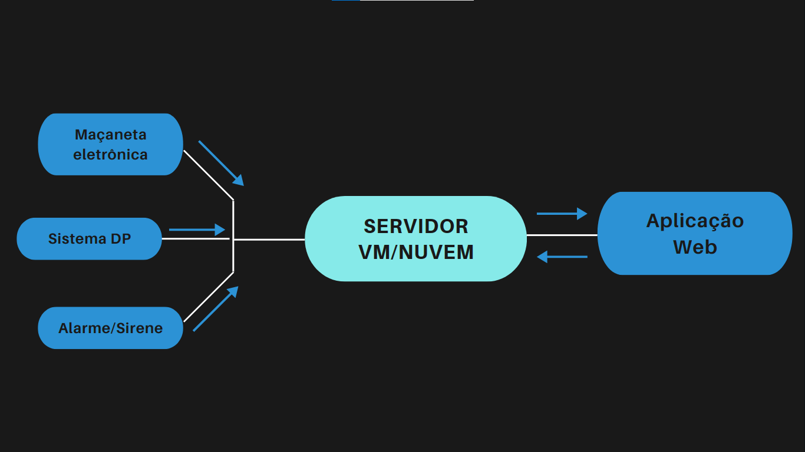

<h1>Challenge Sprint 3 - IoT</h1>

<h2>Descrição</h2>
No nosso projeto, temos por objetivo utilizar o IoT para conectar uma aplicação WEB com alarmes, maçanetas eletrônicas e outros softwares(este último para contatar as DP's)

<h2>Recursos necessários</h2>
<ul>
    <li>Aplicação WEB
    <li>Servidor (Cloud ou VM)
    <li>Alarmes
    <li>Maçanetas
    <li>Softwares específicos em DP's
</ul>

 

<h2>Como reproduzir</h2>

<ol>
    <li>Abrir uma VM ou Cloud
    <li>Torna-la seu servidor
    <li>Iniciar a comunicação com os aparatos
    <li>Iniciar a comunicação com a aplicação WEB
    <li>Linkar tudo junto
    </ol>

<h2>Draft - Arquitetura IoT</h2>

<h2> Integrantes </h2>

Rafael Autieri - RM550885 
Caique Chargas - RM551943 
Rodrigo Resende - RM551057 
Pedro Crispim - RM99005 
Giuliano Romaneto - RM99694 
